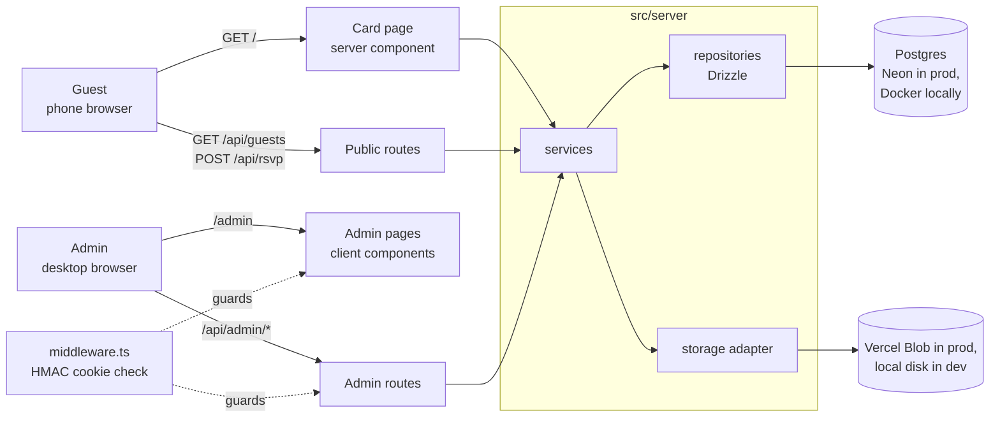

# 02 Architecture

## Shape

A single Next.js application. Server components read from Postgres and render the card. A handful of route handlers serve the admin and the RSVP form. There is no separate backend, queue, cache, or job runner. Nothing here justifies one.



Editable draw.io source: `diagrams/architecture.drawio` (open the link in `diagrams/architecture.drawio.url.txt`).

## Stack

| Concern | Choice | Why this and not something else |
|---|---|---|
| Framework | Next.js 15, App Router, TypeScript strict | Server components give the card a fast first paint; route handlers are enough for the API; Vercel is the deployment target. |
| Styling | Tailwind v4 + a small `card.css` for the theme tokens | Tailwind for the admin (utility density suits forms). The card uses CSS variables so font/colour presets swap without a rebuild. |
| Database | Postgres. Neon in production, `postgres:16` container locally | Relational fits: two tables, one of them a fixed single row. |
| ORM | Drizzle with the `postgres` (postgres.js) driver | One driver that works both against Neon's pooled endpoint and a local container. Drizzle is thin enough to read the whole data layer in minutes. **Do not** use `@neondatabase/serverless`; it needs a websocket proxy locally and breaks the "one driver" rule. |
| Validation | Zod | One schema per input shape, shared by routes and forms. |
| File storage | `StorageAdapter` interface. `VercelBlobStorage` in prod, `LocalDiskStorage` in dev | Vercel functions have no persistent disk. Locally we want zero cloud accounts. |
| Auth | Single admin password from env, HMAC session cookie, checked in `middleware.ts` | One admin. A user table or auth library would be ceremony. |
| Local dev | Docker Compose (`app` + `db`) | Nothing installed on the host but Docker. |

## Layers

```
src/
  app/                       Next.js routes. Thin: parse → call service → respond.
    page.tsx                 Public card (server component)
    admin/                   Admin pages
    api/                     Route handlers
  components/
    card/                    Card, Cover, Countdown, Rsvp, card.css  (shared by page + admin preview)
    admin/                   GuestsTab, CardTab, form primitives
  server/                    Server-only code. Never imported by client components.
    db/                      schema.ts, client.ts, migrations/
    repositories/            guests.repo.ts, settings.repo.ts  (Drizzle queries only)
    services/                guests.service.ts, settings.service.ts, rsvp.service.ts  (rules)
    storage/                 storage.ts (interface), local-disk.ts, vercel-blob.ts, index.ts (picks one)
    auth.ts                  password check, session token
  lib/                       Isomorphic helpers safe for the browser
    validation.ts            Zod schemas
    presets.ts               font + colour presets
    format.ts                Malay and English date/time, phone, map links, ics
    i18n.ts                  every fixed user-facing string in both languages; t(), pick(), cookies
  middleware.ts
```

Rules that keep this honest:

1. **Routes are thin.** A route handler parses input with a Zod schema, calls one service function, and returns JSON. No business logic, no Drizzle.
2. **Services own rules.** The pax cap, the "settings row always exists" guarantee, the upload size limits: these live in services and are tested there.
3. **Repositories own SQL.** One file per table. Functions return plain typed rows.
4. **`lib/` is browser-safe.** Nothing in `lib/` imports from `server/`.
5. **One Card component.** The public page and the admin preview both render `components/card/Card.tsx`. The preview passes unsaved form state as props. If you find yourself copying card markup into the admin, stop.

## Request flows

**Guest opens the card**
`GET /` → `page.tsx` calls `settings.service.get()` → renders `<Card settings=… guests=… />` with CSS variables for the chosen presets (fonts come from `next/font`) → client hydrates CardMotion (cover, entrance, wind, petals), Reveal, Countdown, Rsvp.

**Guest confirms**
`Rsvp.tsx` → `GET /api/guests` (id, label, group_name only; `is_hidden = false`) → user selects → `GET /api/rsvp?guest_id=` for current status and pax → `POST /api/rsvp {guest_id, status, pax}` → `rsvp.service.respond()` clamps pax to the allocation and writes.

**Admin saves the card**
`CardTab.tsx` holds form state → live preview re-renders `<Card>` from that state → `PUT /api/admin/settings` with the full object → `settingsInput.parse()` → `settings.service.update()`.

**Admin uploads music**
`POST /api/admin/upload` (multipart, `kind=music|background`) → `upload.service` checks MIME and size → `storage.put(path, file)` → returns a public URL → admin form sets `music_url`, saved with the next settings PUT.

## Environment variables

| Var | Used by | Notes |
|---|---|---|
| `DATABASE_URL` | Drizzle client | Locally set by Compose; on Vercel injected by the Neon integration |
| `ADMIN_PASSWORD` | `server/auth.ts` | Plain string, compared in constant time |
| `ADMIN_SECRET` | `server/auth.ts` | HMAC key for the session cookie; rotating it logs the admin out |
| `STORAGE_DRIVER` | `server/storage/index.ts` | `local` or `vercel-blob`. Default: `vercel-blob` when `BLOB_READ_WRITE_TOKEN` is present, else `local` |
| `BLOB_READ_WRITE_TOKEN` | `VercelBlobStorage` | Injected by the Vercel Blob integration |
| `NEXT_PUBLIC_SITE_URL` | metadata | Absolute URL for Open Graph images |

## Security posture

- Admin routes and pages are denied by default in `middleware.ts`; only `/admin/login` and `/api/admin/login` are open.
- The session cookie is `httpOnly`, `sameSite=lax`, `secure` in production, 30-day expiry.
- Public routes expose only `id`, `label`, `group_name` for guests. Never `pax`, `status`, or `note`.
- `POST /api/rsvp` is the only public write. It can only change `status` and `confirmed_pax` of an existing, non-hidden row, and `confirmed_pax` is clamped server-side.
- Uploads are validated by MIME type and size before touching storage. File names are generated, never taken from the client.
- No rate limiting in v1. If abuse appears, add Vercel's built-in WAF rule for `/api/rsvp` rather than code.
