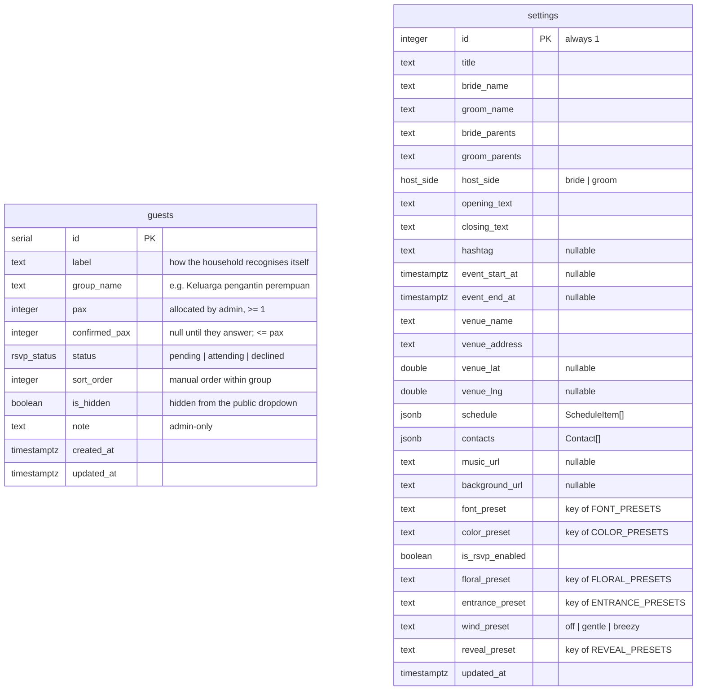

# 03 Data model

Two tables, two enums, no foreign keys. `settings` describes the one event this deployment hosts; `guests` holds the households invited to it. Because one deployment is one event, there is nothing to join.

All identifiers are `snake_case`. Tables are plural. Booleans start with `is_`. Timestamps end in `_at`. Drizzle maps each column to a `camelCase` property explicitly.

## ERD



Editable draw.io source with the same content: `diagrams/erd.drawio` (link in `diagrams/erd.drawio.url.txt`).

## Enums

```sql
CREATE TYPE rsvp_status AS ENUM ('pending', 'attending', 'declined');
CREATE TYPE host_side   AS ENUM ('bride', 'groom');
```

## Table: `guests`

One row per **household**, not per person.

| Column | Type | Null | Default | Rule |
|---|---|---|---|---|
| `id` | `serial` | no | | PK |
| `label` | `text` | no | | 1–120 chars. Written the way the guest would recognise themselves: "Pak Cik Ahmad (Klang) sekeluarga". |
| `group_name` | `text` | no | `'Lain-lain'` | 1–60 chars. Free text; the admin UI offers existing values as suggestions. Drives `<optgroup>` on the card. |
| `pax` | `integer` | no | `1` | 1–50. The allocation. |
| `confirmed_pax` | `integer` | yes | `NULL` | Set on RSVP. `0` when declined. Never greater than `pax` (enforced in `rsvp.service`, and by a CHECK constraint). |
| `status` | `rsvp_status` | no | `'pending'` | |
| `sort_order` | `integer` | no | `0` | Admin ordering within a group. Lower first; ties broken by `label`. |
| `is_hidden` | `boolean` | no | `false` | Hidden rows stay in totals but are excluded from `/api/guests` and rejected by `/api/rsvp`. |
| `note` | `text` | yes | `NULL` | Admin-only, max 500. Never returned by public routes. |
| `created_at` | `timestamptz` | no | `now()` | |
| `updated_at` | `timestamptz` | no | `now()` | Set by the repository on every update. |

Constraints and indexes:

```sql
ALTER TABLE guests ADD CONSTRAINT guests_pax_positive      CHECK (pax >= 1 AND pax <= 50);
ALTER TABLE guests ADD CONSTRAINT guests_confirmed_le_pax  CHECK (confirmed_pax IS NULL OR (confirmed_pax >= 0 AND confirmed_pax <= pax));
CREATE INDEX guests_group_sort_idx ON guests (group_name, sort_order, label);
```

## Table: `settings`

Exactly one row, `id = 1`. `settings.service.get()` inserts the default row if missing so every caller can assume it exists. No route ever inserts or deletes; only `UPDATE … WHERE id = 1`.

| Column | Type | Null | Default | Rule |
|---|---|---|---|---|
| `id` | `integer` | no | `1` | PK. CHECK `(id = 1)`. |
| `title` | `text` | no | `'Majlis Pertunangan'` | ≤ 120 |
| `title_en` | `text` | no | `''` | ≤ 120. English title; blank shows `title` on the English card. |
| `bride_name` | `text` | no | `''` | ≤ 120 |
| `groom_name` | `text` | no | `''` | ≤ 120 |
| `bride_parents` | `text` | no | `''` | ≤ 240. Free text, e.g. "Hj. Kamaruddin bin Ismail & Hjh. Rosnah binti Ahmad" |
| `groom_parents` | `text` | no | `''` | ≤ 240 |
| `host_side` | `host_side` | no | `'bride'` | Whose parents appear as the inviting party and whose name comes first. |
| `opening_text` | `text` | no | Malay default (see schema) | ≤ 600 |
| `opening_text_en` | `text` | no | `''` | ≤ 600. Blank falls back to `opening_text`. |
| `closing_text` | `text` | no | `'Kehadiran dan doa restu tuan/puan amat kami hargai.'` | ≤ 300 |
| `closing_text_en` | `text` | no | `''` | ≤ 300. Blank falls back to `closing_text`. |
| `hashtag` | `text` | yes | `NULL` | ≤ 60, without `#` |
| `event_start_at` | `timestamptz` | yes | `NULL` | Stored UTC; displayed in `Asia/Kuala_Lumpur`. Countdown target. |
| `event_end_at` | `timestamptz` | yes | `NULL` | Optional; used for "11:00 pagi hingga 4:00 petang" and calendar end. Defaults to start + 3 h when null. |
| `venue_name` | `text` | no | `''` | ≤ 160 |
| `venue_address` | `text` | no | `''` | ≤ 400, newlines allowed |
| `venue_lat` | `double precision` | yes | `NULL` | −90..90. Both lat and lng must be set for map buttons to render. |
| `venue_lng` | `double precision` | yes | `NULL` | −180..180 |
| `schedule` | `jsonb` | no | `'[]'` | `ScheduleItem[]`, ≤ 20 items |
| `contacts` | `jsonb` | no | `'[]'` | `Contact[]`, ≤ 10 items |
| `music_url` | `text` | yes | `NULL` | Public URL from the storage adapter |
| `background_url` | `text` | yes | `NULL` | Public URL from the storage adapter |
| `font_preset` | `text` | no | `'classic'` | Must be a key of `FONT_PRESETS`; unknown keys fall back to `classic` at render time. |
| `color_preset` | `text` | no | `'blush'` | Must be a key of `COLOR_PRESETS`; fallback `blush`. |
| `is_rsvp_enabled` | `boolean` | no | `true` | When false the Kehadiran section is hidden and `POST /api/rsvp` returns 403. |
| `floral_preset` | `text` | no | `'peony_corners'` | Key of `FLORAL_PRESETS` (see `docs/05` → Floral themes). Fallback `peony_corners`. |
| `entrance_preset` | `text` | no | `'petal_fall'` | Key of `ENTRANCE_PRESETS`. Fallback `petal_fall`. |
| `wind_preset` | `text` | no | `'gentle'` | `off` \| `gentle` \| `breezy`. |
| `reveal_preset` | `text` | no | `'fade_up'` | Key of `REVEAL_PRESETS`. |
| `default_language` | `text` | no | `'ms'` | `ms` \| `en`. The card's language until the guest picks one (cookie `lang`). |
| `updated_at` | `timestamptz` | no | `now()` | |

### JSON shapes (also the Zod schemas)

```ts
type ScheduleItem = { time: string; label: string; timeEn?: string; labelEn?: string }; // time ≤ 20, label ≤ 120; *En blank → Malay shown
type Contact      = { name: string; relation?: string; relationEn?: string; phone: string }; // phone: Malaysian, digits only after normalisation
```

Why jsonb and not tables: both lists are small (≤ 20 rows), always read and written together with the settings row, and have no queries of their own. A table each would add two repositories and two sets of routes to save nothing.

## Drizzle schema (reference)

```ts
// src/server/db/schema.ts
import { pgTable, pgEnum, serial, integer, text, boolean, doublePrecision, jsonb, timestamp, check, index } from "drizzle-orm/pg-core";
import { sql } from "drizzle-orm";

export const rsvpStatus = pgEnum("rsvp_status", ["pending", "attending", "declined"]);
export const hostSide   = pgEnum("host_side", ["bride", "groom"]);

export const guests = pgTable("guests", {
  id:           serial("id").primaryKey(),
  label:        text("label").notNull(),
  groupName:    text("group_name").notNull().default("Lain-lain"),
  pax:          integer("pax").notNull().default(1),
  confirmedPax: integer("confirmed_pax"),
  status:       rsvpStatus("status").notNull().default("pending"),
  sortOrder:    integer("sort_order").notNull().default(0),
  isHidden:     boolean("is_hidden").notNull().default(false),
  note:         text("note"),
  createdAt:    timestamp("created_at", { withTimezone: true }).notNull().defaultNow(),
  updatedAt:    timestamp("updated_at", { withTimezone: true }).notNull().defaultNow(),
}, (t) => [
  check("guests_pax_positive", sql`${t.pax} >= 1 AND ${t.pax} <= 50`),
  check("guests_confirmed_le_pax", sql`${t.confirmedPax} IS NULL OR (${t.confirmedPax} >= 0 AND ${t.confirmedPax} <= ${t.pax})`),
  index("guests_group_sort_idx").on(t.groupName, t.sortOrder, t.label),
]);

export const settings = pgTable("settings", {
  id:             integer("id").primaryKey().default(1),
  title:          text("title").notNull().default("Majlis Pertunangan"),
  brideName:      text("bride_name").notNull().default(""),
  groomName:      text("groom_name").notNull().default(""),
  brideParents:   text("bride_parents").notNull().default(""),
  groomParents:   text("groom_parents").notNull().default(""),
  hostSide:       hostSide("host_side").notNull().default("bride"),
  openingText:    text("opening_text").notNull().default("Dengan penuh kesyukuran ke hadrat Ilahi, kami mempersilakan tuan/puan ke majlis pertunangan anakanda kami"),
  closingText:    text("closing_text").notNull().default("Kehadiran dan doa restu tuan/puan amat kami hargai."),
  hashtag:        text("hashtag"),
  eventStartAt:   timestamp("event_start_at", { withTimezone: true }),
  eventEndAt:     timestamp("event_end_at", { withTimezone: true }),
  venueName:      text("venue_name").notNull().default(""),
  venueAddress:   text("venue_address").notNull().default(""),
  venueLat:       doublePrecision("venue_lat"),
  venueLng:       doublePrecision("venue_lng"),
  schedule:       jsonb("schedule").$type<ScheduleItem[]>().notNull().default([]),
  contacts:       jsonb("contacts").$type<Contact[]>().notNull().default([]),
  musicUrl:       text("music_url"),
  backgroundUrl:  text("background_url"),
  fontPreset:     text("font_preset").notNull().default("classic"),
  colorPreset:    text("color_preset").notNull().default("blush"),
  isRsvpEnabled:  boolean("is_rsvp_enabled").notNull().default(true),
  floralPreset:   text("floral_preset").notNull().default("peony_corners"),
  entrancePreset: text("entrance_preset").notNull().default("petal_fall"),
  windPreset:     text("wind_preset").notNull().default("gentle"),
  revealPreset:   text("reveal_preset").notNull().default("fade_up"),
  updatedAt:      timestamp("updated_at", { withTimezone: true }).notNull().defaultNow(),
}, (t) => [ check("settings_singleton", sql`${t.id} = 1`) ]);
```

## Migrations

Generated with `drizzle-kit generate` into `src/server/db/migrations/` and committed. Applied with `drizzle-kit migrate` (both locally via Compose and once against Neon at first deploy). Do not use `drizzle-kit push` outside a throwaway local database; migrations must be reproducible for the next person who forks this.

## Derived values (computed, never stored)

| Value | Where | Rule |
|---|---|---|
| Headcount totals | `guests.service.totals()` | invited = Σ pax; attending = Σ confirmed_pax where attending; declined = Σ pax where declined; pending = Σ pax where pending |
| Countdown | client | `event_start_at − now`, ticking every second |
| Map links | `lib/format.ts` | Google: `https://www.google.com/maps/search/?api=1&query={lat},{lng}`; Waze: `https://waze.com/ul?ll={lat},{lng}&navigate=yes` |
| WhatsApp link | `lib/format.ts` | `https://wa.me/{60XXXXXXXXX}`; `0123456789` → `60123456789` |
| Display date | `lib/format.ts` | `Intl.DateTimeFormat("ms-MY", …, { timeZone: "Asia/Kuala_Lumpur" })`; time period pagi/tengah hari/petang/malam by hour |
